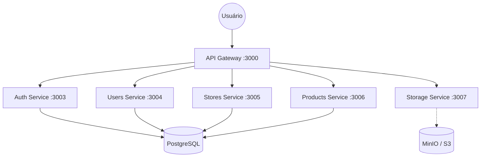

# CasaShopping Guide (Guia de Compras)

Plataforma digital de **Catálogo de Produtos** e **Gestão Administrativa** desenvolvida para o CasaShopping. O projeto adota uma **Arquitetura de Microsserviços**, focando em escalabilidade, manutenibilidade e deploy independente de cada componente.

---

## 🚀 Visão Geral do Projeto

O sistema é composto por múltiplos módulos integrados em uma estrutura **Monorepo (Turborepo)**:

| Módulo             | Descrição                                    | Porta |
| ------------------ | -------------------------------------------- | ----- |
| `web`              | Storefront público (catálogo de produtos)    | 3001  |
| `admin`            | Painel administrativo para gestão            | 3002  |
| `api-gateway`      | Proxy unificado para todos os microsserviços | 3000  |
| `auth-service`     | Autenticação e gestão de sessões (JWT)       | 3003  |
| `users-service`    | Gestão de usuários e perfis                  | 3004  |
| `stores-service`   | Gestão de lojas                              | 3005  |
| `products-service` | Gestão de produtos, categorias e favoritos   | 3006  |
| `storage-service`  | Upload de imagens (S3/MinIO)                 | 3007  |

## ✨ Principais Funcionalidades

### Storefront (Web)

- **Modo Visitante (Guest Mode)**: Navegação completa por produtos e lojas sem necessidade de login.
- **Vitrine Virtual**: Destaques, carrosséis de categorias e busca avançada.
- **Favoritos**: Usuários logados podem salvar produtos.
- **Preço Sob Consulta**: Suporte a produtos sem preço exibido publicamente.

### Painel Administrativo

- **Gestão de Lojas**: Cadastro e edição de informações de lojas.
- **Catálogo de Produtos**: Criação, edição e inativação de produtos.
- **Upload de Mídia**: Integração com Storage Service para imagens de produtos e logos.

### Diagrama de Arquitetura



---

## 🛠 Tech Stack

| Camada               | Tecnologia                                 |
| -------------------- | ------------------------------------------ |
| **Frontend**         | Next.js 14 (App Router), React, TypeScript |
| **Estilização**      | Tailwind CSS, shadcn/ui                    |
| **Backend**          | NestJS, Node.js 20                         |
| **Banco de Dados**   | PostgreSQL 15                              |
| **ORM**              | Prisma                                     |
| **Storage**          | MinIO (dev) / AWS S3 (prod)                |
| **Infraestrutura**   | Docker, Docker Compose, Turborepo          |
| **Validação**        | Zod, class-validator                       |
| **State Management** | TanStack Query (React Query), Zustand      |

---

## 📦 Como Rodar Localmente

### Pré-requisitos

- Node.js 20+
- pnpm (`npm install -g pnpm`)
- Docker & Docker Compose

### Instalação

1. Clone o repositório:

   ```bash
   git clone https://github.com/Joao-19/CasaShopping-guide.git
   cd casashopping-guide
   ```

2. Copie os arquivos de ambiente de exemplo:

   ```bash
   cp .env.example .env
   cp apps/web/.env.example apps/web/.env
   cp apps/admin/.env.example apps/admin/.env
   cp apps/api-gateway/.env.example apps/api-gateway/.env
   cp apps/auth/.env.example apps/auth/.env
   cp apps/users/.env.example apps/users/.env
   cp apps/stores/.env.example apps/stores/.env
   cp apps/products/.env.example apps/products/.env
   cp apps/storage/.env.example apps/storage/.env
   ```

3. Instale as dependências:

   ```bash
   pnpm install
   ```

4. Suba o banco de dados e o MinIO:

   ```bash
   docker-compose up -d database storage
   ```

5. Execute as migrations do Prisma:

   ```bash
   pnpm --filter @repo/database db:migrate
   ```

6. Inicie todos os serviços em modo de desenvolvimento:
   ```bash
   pnpm dev
   ```

### Acessando os Serviços

| Serviço       | URL                   |
| ------------- | --------------------- |
| Web App       | http://localhost:3001 |
| Admin Panel   | http://localhost:3002 |
| API Gateway   | http://localhost:3000 |
| MinIO Console | http://localhost:9001 |

---

## 🐳 Deploy com Docker

Para subir todo o ambiente com Docker Compose:

```bash
docker-compose up -d --build
```

Isso irá criar e iniciar todos os containers (banco, storage, serviços e frontends).

> [!IMPORTANT]
> **Configuração do MinIO (Local/Dev)**:
> Para que o upload de imagens funcione corretamente localmente, pode ser necessário configurar o CORS no bucket do MinIO. Certifique-se de que a variável `MINIO_PUBLIC_ENDPOINT` esteja apontando para o IP/domínio correto acessível pelo navegador, não apenas `localhost` se estiver testando em rede ou mobile.

---

## 📁 Estrutura do Projeto

```
casashopping-guide/
├── apps/
│   ├── admin/          # Painel Administrativo (Next.js)
│   ├── api-gateway/    # API Gateway (NestJS)
│   ├── auth/           # Auth Service (NestJS)
│   ├── products/       # Products Service (NestJS)
│   ├── storage/        # Storage Service (NestJS)
│   ├── stores/         # Stores Service (NestJS)
│   ├── users/          # Users Service (NestJS)
│   └── web/            # Storefront Público (Next.js)
├── packages/
│   ├── database/       # Prisma Schema e Client compartilhado
│   ├── dtos/           # DTOs e Types compartilhados
│   ├── ui/             # Componentes UI compartilhados
│   └── auth-guard/     # Módulo de autenticação compartilhado
├── docker-compose.yml
├── turbo.json
└── pnpm-workspace.yaml
```

---

## 🔐 Variáveis de Ambiente

Consulte os arquivos `.env.example` em cada diretório para ver as variáveis necessárias. As principais são:

| Variável                | Descrição                            |
| ----------------------- | ------------------------------------ |
| `DATABASE_URL`          | String de conexão do PostgreSQL      |
| `JWT_SECRET`            | Secret para assinatura de tokens JWT |
| `MINIO_PUBLIC_ENDPOINT` | Endpoint público do MinIO/S3         |
| `NEXT_PUBLIC_API_URL`   | URL do API Gateway para os frontends |

---

## 📄 Documentação Adicional

- **Requisitos de Infraestrutura (AWS):** [REQUISITOS_INFRA.md](./REQUISITOS_INFRA.md)

---

## 📝 Licença

Este projeto é privado e de uso exclusivo do CasaShopping.
