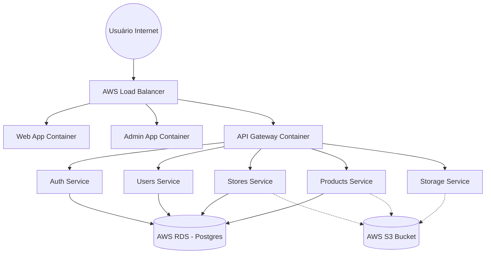

# Especificação de Infraestrutura - CasaShopping Guide

Este documento detalha os requisitos de infraestrutura para o deploy da aplicação **CasaShopping Guide** em ambiente AWS, cobrindo os serviços de backend, frontend, banco de dados e storage.

## 1. Visão Geral da Arquitetura

O sistema utiliza microserviços em Node.js (NestJS) e frontends em Next.js.

### Componentes:

- **Frontends**: `web` (Clientes) e `admin` (Painel Adm).
- **Gateways**: `api-gateway` (Proxy unificado).
- **Serviços**: `auth`, `users`, `stores`, `products`, `storage`.
- **Persistence**: PostgreSQL 15 + AWS S3.



---

## 2. Requisitos de Infraestrutura AWS

### A. Compute (ECS Fargate)

Dimensionamento sugerido (Cluster ECS):

> **Nota**: As especificações abaixo são recomendações baseadas no perfil da aplicação para o deploy inicial. A configuração final de recursos (CPU/RAM) fica a critério da equipe de infraestrutura, que poderá ajustar conforme necessário.

| Serviço            | Porta | CPU  | RAM | Contexto                |
| :----------------- | :---- | :--- | :-- | :---------------------- |
| `web`              | 3001  | 0.5  | 1.0 | Frontend Público        |
| `admin`            | 3002  | 0.5  | 1.0 | Frontend Administrativo |
| `api-gateway`      | 3000  | 0.5  | 1.0 | Entrypoint API          |
| `auth-service`     | 3003  | 0.25 | 0.5 | Auth e JWT              |
| `users-service`    | 3004  | 0.25 | 0.5 | Perfil e Usuários       |
| `stores-service`   | 3005  | 0.25 | 0.5 | Catálogo de Lojas       |
| `products-service` | 3006  | 0.5  | 1.0 | Catálogo de Produtos    |
| `storage-service`  | 3007  | 0.25 | 1.0 | Upload/Sign S3          |

### B. Banco de Dados (RDS PostgreSQL 15)

- **Instância**: `db.t3.micro` ou superior.
- **Novos Modelos**: O banco agora gerencia `Favorites`, `Categories` e `ProductImage` (além de `Users`, `Admins` e `Stores`).
- **Migration**: Executar `npx prisma migrate deploy` no CI/CD a partir do diretório raiz (usando o workspace `@repo/database`).

### C. Storage (AWS S3) - **ATUALIZADO**

O `storage-service` gera **URLs Pré-assinadas** para upload direto do browser para o S3.

1.  **Configuração do Bucket**:
    - **CORS**: Ativado para permitir `PUT`, `POST` e `GET` das origens (domínios do frontend).
    - **Políticas**: O bucket deve permitir LEITURA PÚBLICA (`s3:GetObject`) para que as imagens sejam exibidas diretamente aos usuários via URL do S3.
2.  **Limites de Payload**:
    - Configurar o Load Balancer (ALB) ou CloudFront para aceitar uploads de até 50MB (limite atual de vídeos no código).
3.  **Ambiente**:
    - Em produção, desativar a lógica de `ensureBucket` (auto-criação) do `storage-service` se o bucket for gerenciado via IaC (Terraform/CloudFormation).

---

## 3. Variáveis de Ambiente (Configuração)

### Backend (Common)

```env
DATABASE_URL="postgresql://[USER]:[PASSWORD]@[HOST]:5432/casashopping?schema=public"
JWT_SECRET="[SECRET_GLOBAL_REQUIRED]"
JWT_EXPIRES_IN="1d"
REFRESH_TOKEN_SECRET="[SECRET_REFRESH]"
REFRESH_TOKEN_EXPIRES_IN="7d"

# Service Discovery (DNS interno do ECS/CloudMap)
AUTH_SERVICE_URL="http://auth-service.local:3003"
USERS_SERVICE_URL="http://users-service.local:3004"
STORE_SERVICE_URL="http://stores-service.local:3005"
PRODUCTS_SERVICE_URL="http://products-service.local:3006"
STORAGE_SERVICE_URL="http://storage-service.local:3007"
```

### Storage Service (Específico S3)

```env
# Credenciais IAM (Caso não utilize Task Role)
AWS_ACCESS_KEY_ID="[Key]"
AWS_SECRET_ACCESS_KEY="[Secret]"
AWS_REGION="sa-east-1"

# Mapeamento do Storage
MINIO_ROOT_USER="[Link com AWS_ACCESS_KEY_ID]"
MINIO_ROOT_PASSWORD="[Link com AWS_SECRET_ACCESS_KEY]"
MINIO_BUCKET_NAME="casashopping-media"
MINIO_PUBLIC_ENDPOINT="https://s3.sa-east-1.amazonaws.com"
MINIO_INTERNAL_ENDPOINT="https://s3.sa-east-1.amazonaws.com"

# Limites de Aplicação
MAX_IMAGE_SIZE_MB=5
MAX_VIDEO_SIZE_MB=50
```

### Frontends (Web & Admin)

```env
# URL do LB que aponta para o API Gateway
NEXT_PUBLIC_API_URL="https://api.casashopping.guide"

# URLs para Links Cruzados (Web <-> Admin)
NEXT_PUBLIC_ADMIN_URL="https://admin.casashopping.guide"
NEXT_PUBLIC_WEB_URL="https://casashopping.guide"
```

---

## 4. Observações de Segurança e Escalabilidade

- **Segurança**: O `api-gateway` e os microserviços agora exigem validação de `JWT_SECRET`. Certifique-se de que a secret seja idêntica em todos os serviços.

- **SSL/TLS**: Recomendamos o uso de **AWS Certificate Manager (ACM)** atrelado ao ALB para terminar o SSL.
